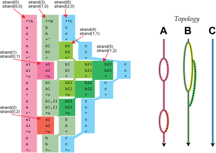

<h3> 2-D row/column iteration of tokens </h3>

You can uniquely iterate through all tokens in a Humdrum file using
two methods. The simplest one involves iterating first by line and
then by field within each line. Below is a short program that
demonstrates this process by echoing the input Humdrum file contents
in the same format as a standard TSV Humdrum file 

```cpp

```

You can copy this code to `cli/humecho.cpp` and then in the base
directory of humlib type `make library && make humecho` to compile
to `bin/humecho`.

The lines in the file represent a sequence of data that is sorted
in chronological order.  This row/column iteration method is suitable
for temporal processing of all data tokens.


<h3> 1-D strand iteration </h3>

To iterate through all spines in an different order, the humlib library
introduces the concept of *strands*. A strand is a sequence of
tokens in a particular spine that does not include spine splits or
merges. The following figure shows example Humdrum data 
with individual strands highlighted in different colors.



Each spine consists of a primary strand which is continuous
throughout the total length of the spine.  When a spine
splits into sub-spines, a new strand starts at the beginning
of the right-side branch of the split, while the previous
strand continues along the left-side branch.

The strand segments can be used to iterate through all tokens in
the file (excluding non-spine lines, which are global comments,
reference records and empty lines).  A one-dimensional iteration
through all tokens is illustrated in the following code:

```cpp

```

The example Humdrum data contains seven 1-D strands and the example
program prints the row/column in the original data that the tokens
originate.

<details markdown="1">
<summary> Click to view output of the program using the illustrated data </summary>
```

```
</details>


<h3> 2-D strand iteration </h3>

A related two-dimensional iteration through the spine tokens can
generate the same ordering as the 1-D strand iteration.  The main
difference is that you can select one or more spines to strand in
advance and only iterate through all strands in those spines,
ignoring strands in other spines.

In the following example the strands are first iterated through by
spine index, and then by strands in the spines, always starting
with the primary strand which follows the lefthand side of spine
splits from the starting exclusive interpretation of the spine.

```cpp

Humdrum infile;
HumdrumToken* tok;
for (int i=0; i<infile.getSpineCount(); i++) {
	for (int j=0; j<infile.getStrandCount(i); j++) {
	tok = infile.getStrandStart(i, j);
	while (!tok->isStrandEnd()) {
		cout << *tok << endl;
		tok->getNextToken();
	}
}


```

When spines do not split or merge, then strands are equivalent to
spines.  The following code examples will generate the same data
ordering:

```cpp
for (i=0; i<infile.getSpineCount(); i++) {
	tok = infile.getSpineStart(i);
	while (!tok->isTerminator()) {
		cout << *tok << endl;
		tok = tok->getNextToken();
	}
}

for (int i=0; i<infile.getStrandCount(); i++) {
	tok = infile.getStrandStart(i);
	while (!tok->isStrandEnd()) {
		cout << *tok << endl;
		tok->getNextToken();
	}
}
```

Primary strands always start with an exclusive interpretation (interpretation
token which starts with \*\* followed by the data type), and are ended with the
terminate manipulator (`*-`).  Secondary strands always start with a 
non-exclusive interpretation, and typically end at a merge manipulator
(`*v`), although unmerged sub-strands will end with a terminate token.


