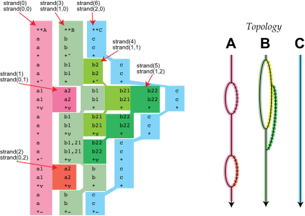

<h2> 2-D row/column iteration of tokens </h2>

You can uniquely iterate through all tokens in a Humdrum file using
two methods. The simplest one involves iterating first by line and
then by field within each line. Below is a short program that
demonstrates this process by echoing the input Humdrum file contents
in the same format as a standard TSV Humdrum file 

```cpp

```

You can copy this code to `cli/humecho.cpp` and then in the base
directory of humlib type `make library && make humecho` to compile
to `bin/humecho`.

The lines in the file represent a sequence of data that is sorted
in chronological order.  This row/column iteration method is suitable
for temporal processing of all data tokens.


<h2> 1-D strand iteration </h2>

To iterate through all spines in an different order, the humlib library
introduces the concept of *strands*. A strand is a sequence of
tokens in a particular spine that does not include spine splits or
merges. The following figure shows example Humdrum data 
with individual strands highlighted in different colors.



* [Example data file](strand.txt)


Each spine consists of a primary strand which is continuous throughout
the total length of the spine (the left-most path in the topology
diagram).  When a spine splits into sub-spines, a new strand starts
at the beginning of the right-hand branch of the split, while the
previous strand continues along the left-hand branch.

The strand segments can be used to iterate through all tokens in
the file (excluding non-spined lines, which are global comments,
reference records and empty lines).  A one-dimensional iteration
through all strands is illustrated in the following code:

```cpp

```

The example Humdrum data contains seven 1-D strands and the example
program prints the row/column in the original data that the tokens
originate.

<details markdown="1">
<summary> Click to view output of the program using the illustrated data </summary>
```

```
</details>


<h2> 2-D strand iteration </h2>

A variant of iterating through strands is a 2-D method demonstrated
below, where the strand list is limited to a specific spine.  The
main difference is that you can select one or more spines to process
in advance and only iterate through all strands in those spines,
ignoring strands in other spines not being processed.  In the
following example the strands are first iterated through by spine
index, and then by strands within each spine.

```cpp

```

Primary strands always start with an exclusive interpretation (tokens
that start with `**` followed by the data type) and are ended with
a termination manipulator (`*-`).  Secondary strands always start
with a token that immediately follows a spine split (`*^`), and
typically end at a merge manipulator (`*v`), although unmerged
sub-strands will end with a termination token.

Note that If a spine is not terminated properly, the <span class="mhcf
paren">HumdrumToken::getNextToken</span> function will return a
`NULL` pointer, so it is useful to terminate strands if either 
the current token is `NULL` or if it is the target end token.  This is
the purpose of the `while (current)` condition in the strand code 
examples above.

<h2 markdown="1"> Efficient iteration through all \*\*kern data</h2>

If you want to count all notes in a file, you can use the row/column
method described at the start of this section:

```cpp

```

If there are non-kern spines, all of the tokens in these spines will be
processed.  

In the following example, only tokens in kern spines will be
processed, and non-kern spines will be ignored.  In this case strands
are used to iterate through the data, and any non-kern strands are
skipped over.

```cpp

```

Here is an alternate method of using 2-D access of strands.  First
a list of kern spine starts is extract from the Humdrum data, and
then the strands of these spines are iterated over.  This method
avoids checking strands that occur in non-kern spines.

```cpp

```


